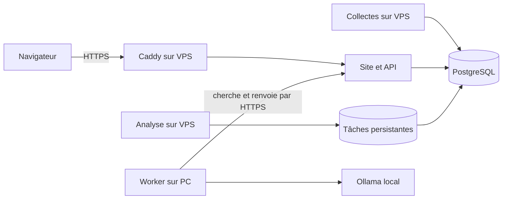

# Site sur VPS, IA sur PC Windows

Le VPS héberge Next.js, FastAPI, les collectes, PostgreSQL et Redis. Le PC exécute
uniquement le worker et Ollama. Il contacte le VPS en **HTTPS sortant** : aucune
redirection de port, aucun accès PostgreSQL/Redis depuis le PC, aucun Ollama public.
Le worker reçoit des passages déjà sélectionnés et bornés, pas des commandes ou
des URL à télécharger. Le VPS valide le schéma et les citations avant intégration.



## 1. Préparer les fichiers depuis Windows

Prérequis : Docker Desktop démarré, dépôt à jour, domaine pointant vers le VPS,
Docker Compose **2.24.4+** sur les deux machines. Prévoir plusieurs Go pour le modèle
et suffisamment de RAM (le modèle par défaut fait 4 milliards de paramètres ;
l'exécution CPU fonctionne, mais sa vitesse dépend du PC). Le PC doit rester éveillé.

Double-cliquer `Configurer-IA.bat` et indiquer `https://votre-domaine.fr`, ou :

```powershell
powershell -NoProfile -ExecutionPolicy Bypass -File deploy/Configure-Hybrid.ps1 -SiteUrl https://votre-domaine.fr
```

Le script conserve les configurations existantes et ne modifie pas `.env` :

- `private-data/worker.env` : URL, modèle et jeton **brut**, uniquement sur le PC ;
- `private-data/hybrid/vps.env` : configuration serveur avec mot de passe PostgreSQL
  aléatoire et **empreinte SHA-256** du jeton, à transférer au VPS par SSH/SFTP.

Ces fichiers sont ignorés par Git et protégés par les ACL Windows. Ne pas copier
le jeton brut dans le frontend, les logs, le serveur ou un message. Le jeton autorise
uniquement la prise de tâches, les résultats et le heartbeat ; il n'ouvre pas les
pages protégées ni les fonctions de portefeuille. Une session web ne l'autorise pas.

Compléter dans `vps.env` : `ACME_EMAIL`, `SEC_USER_AGENT`, éventuellement la clé
Alpha Vantage et le destinataire public `BACKUP_RECIPIENT`. Le modèle doit être
identique sur les deux machines. Pour le révoquer, générer un nouveau jeton aléatoire,
remplacer son empreinte sur le VPS et le jeton sur le PC puis recréer les services.

## 2. Installer sur le VPS

Cloner le dépôt, créer `private-data`, transférer **seulement** le fichier serveur
vers `private-data/vps.env`, puis depuis le dépôt :

```sh
chmod 700 private-data
chmod 600 private-data/vps.env
sh deploy/vps.sh up
sh deploy/vps.sh admin administrateur
sh deploy/vps.sh status
```

La commande `admin` demande un mot de passe sans l'afficher. Pas d'inscription
publique. L'authentification et les cookies HTTPS sont obligatoires. Le domaine
et les contacts d'exemple sont refusés par le contrôle préalable.

Le fichier **autonome** `docker-compose.production.yml` sélectionne les services
web sans Ollama. Il ignore volontairement `docker-compose.override.yml` local et
utilise des volumes propres au projet `market-ai-vps`. Seul Caddy publie 80/443 ;
les ports 3000/8000, PostgreSQL et Redis restent internes. Le DNS A/AAAA doit pointer
correctement vers le VPS et 80/443 être accessibles pour le certificat HTTPS.
Les mécanismes utilisés sont décrits dans la documentation officielle
[Docker Compose](https://docs.docker.com/reference/compose-file/merge/) et
[HTTPS automatique Caddy](https://caddyserver.com/docs/automatic-https).

Les données du Docker local **ne sont pas transférées automatiquement**. Les volumes
production commencent vides. Pour retrouver les données existantes, prévoir une
migration explicite depuis une sauvegarde vérifiée, puis transférer les fichiers
privés autorisés (exports WLS, imports) ; ne pas écraser une base existante.

### Sauvegardes

Réutiliser la procédure [sauvegarde et restauration](DEPLOYMENT.md#sauvegardes-postgresql-chiffrées)
pour générer une clé age sur une machine de confiance. Conserver la clé privée
hors du VPS, renseigner **le destinataire public** dans `private-data/vps.env`, puis :

```sh
sh deploy/vps.sh backup
sh deploy/vps.sh logs backup
```

Sauvegardes chiffrées quotidiennes, rétention 14 jours, archives dans
`private-data/backups`. Ce service optionnel doit être activé explicitement ;
il n'est pas lancé si vous n'exécutez que `up`. Copier les archives hors du VPS et
vérifier une restauration dans une base séparée. L'arrêt du worker n'affecte pas les
sauvegardes. L'arrêt du VPS interrompt ses services mais conserve leurs volumes.

## 3. Lancer et arrêter le PC

- `Demarrer-IA.bat` : démarre Ollama, télécharge le modèle si absent, construit
  le worker puis le démarre en arrière-plan. Fermer la fenêtre ne l'arrête pas.
- `Arreter-IA.bat` : arrête **uniquement** les deux services du projet worker,
  sans supprimer les modèles, les données ou les services web locaux/VPS.
- `Etat-IA.bat` : affiche l'état Docker et les derniers messages du worker.

Le premier téléchargement peut durer plusieurs minutes. Aucune carte graphique
n'est exigée par cette configuration CPU ; l'accélération GPU nécessite une
configuration Docker adaptée et n'est pas activée par ces lanceurs.
Les conteneurs n'ont pas de redémarrage automatique après redémarrage Docker/PC :
relancer `Demarrer-IA.bat`. Pour suivre côté site, ouvrir **Suivi des collectes**.
Un heartbeat récent indique le contact du worker, sans garantir un résultat correct.

## Coupures et contrôles

Les tâches sont conservées dans PostgreSQL, identifiées par le contenu, le modèle
et la version du prompt. Un résultat déjà accepté est réutilisé sans nouvel appel
LLM. Les succès par passage et les règles de provenance existantes restent en place.
Le worker utilise le même code de prompt que le serveur ; mettre à jour les deux.
Ne pas changer de mode d'exécution pendant une analyse active : arrêter le scheduler,
reconfigurer puis reprendre après expiration de son ancien bail.

PC éteint : collecte, pages et simulation restent disponibles ; l'enrichissement IA
attend. Le scheduler attend au maximum `AI_REMOTE_WAIT_SECONDS` par passage (900 s),
conserve la tâche puis reprend lors d'un cycle suivant. Un résultat livré après
cette attente est intégré au prochain cycle, pas forcément immédiatement à l'écran.
Les erreurs d'analyse historiques peuvent donc rester visibles pendant l'attente.

Arrêt brutal pendant une tâche : le bail expire après le timeout Ollama + 120 s.
Un autre passage ne peut pas voler un bail actif ; un résultat tardif d'un ancien
bail est refusé. Les réponses sont bornées et les citations doivent exister dans
le passage attribué. L'accusé de réception peut être rejoué sans doublon.
Une erreur fournisseur attend 10 min avant reprise ; maximum trois tentatives
par tâche, puis intervention explicite après correction :

```sh
sh deploy/vps.sh ai-status
sh deploy/vps.sh retry-ai UUID_DE_LA_TACHE_EN_ECHEC
```

Si le VPS est indisponible, le worker retente sans exposer sa clé et sans désactiver
TLS. La réponse en cours est renvoyée avec reprises bornées ; en cas de perte définitive,
le bail expire et la tâche est recalculée (au plus trois tentatives). Aucun appel LLM
de secours n'est effectué sur le VPS. Le jeton ne certifie pas la véracité des
interprétations du modèle : les sorties restent des faits extraits à examiner.

## Mise à jour et arrêt du VPS

Après mise à jour du dépôt : `sh deploy/vps.sh up` reconstruit et applique les migrations.
Puis relancer `Demarrer-IA.bat` depuis le dépôt mis à jour sur le PC.
`sh deploy/vps.sh stop` arrête le projet sans supprimer les volumes.
Ne pas lancer le Compose local sur le VPS ni copier `.env` ou l'override du PC.

## Vérifications réalisées et reproductibles

`docker compose run --rm backend pytest` utilise des paramètres de test locaux
indépendants de l'activation des comptes. Les tests d'accès fixent leurs propres
paramètres ; les services démarrés ne sont pas modifiés par cette configuration.

`deploy/Test-HybridLaunchers.ps1` exerce la génération de secrets et les opérations
des lanceurs avec Docker simulé, dans un dossier temporaire privé. Le test refuse
d'écraser une configuration et vérifie que le jeton brut ne se retrouve pas dans
le fichier serveur. Les tests PostgreSQL `tests.smoke_remote_ai` et
`tests.smoke_remote_pipeline` exigent une base dédiée dont le nom se termine par
`_qa` ; le second y conserve ses fixtures jusqu'à suppression de cette base.
Ils simulent Ollama, sans appel IA ou collecte réseau. Le script frontend
`scripts/check-ai-status.mjs` vérifie dix écrans avec API simulée.
